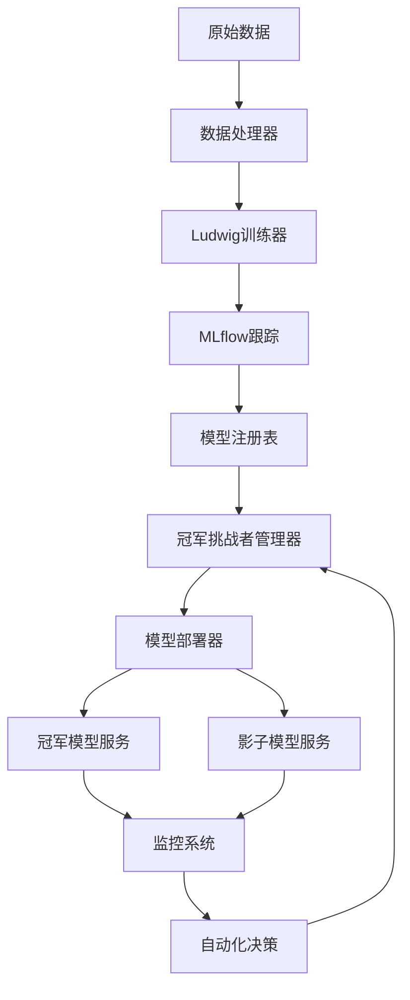

# MLOps Champion-Challenger Model Lifecycle Management

基于SAS冠军挑战者模型生命周期管理策略的完整MLOps解决方案，整合Ludwig和MLflow框架，实现容器化的模型开发上线和模型生命周期管理流程。

## 🏗️ 系统架构

```
数据 → Ludwig训练（生成挑战者模型） → MLflow跟踪 → 模型打包与注册 → 部署（冠军+影子模式） → 监控与自动化
```


### 2. 启动基础服务

```bash
# 启动MLflow、数据库、监控等服务
cd docker
docker-compose up -d
```

### 3. 生成示例数据

```bash
# 生成基础训练数据
python examples/generate_sample_data.py --samples 10000 --output-dir data/raw

# 生成带漂移的数据（用于测试挑战者）
python examples/generate_sample_data.py --samples 5000 --generate-drift --output-dir data/raw
```

### 4. 训练第一个挑战者模型

```bash
# 训练挑战者模型
python scripts/train_challenger.py --data-path data/raw/baseline_full.csv --auto-evaluate
```

### 5. 运行生命周期管理

```bash
# 手动运行一次生命周期循环
python scripts/run_lifecycle_cycle.py --data-path data/raw/drift_full.csv

# 查看系统状态
python scripts/run_lifecycle_cycle.py --dry-run
```

## 📊 Web界面

访问以下地址查看系统状态：

- **MLflow UI**: http://localhost:5000
- **模型注册表UI**: http://localhost:8080
- **Grafana监控**: http://localhost:3000 (admin/admin)
- **Prometheus**: http://localhost:9090

## 🔧 配置说明

### 主配置文件 (`config/config.yaml`)

```yaml
# 数据配置
data:
  input_path: "data/raw/"
  processed_path: "data/processed/"
  target_column: "target"

# Ludwig训练配置
ludwig:
  config_path: "config/ludwig_config.yaml"
  output_directory: "models/ludwig_output/"

# MLflow配置
mlflow:
  tracking_uri: "http://localhost:5000"
  experiment_name: "champion_challenger_lifecycle"

# 冠军挑战者策略
champion_challenger:
  evaluation_metrics: ["accuracy", "precision", "recall", "f1_score"]
  champion_threshold: 0.05  # 最小改进阈值
  shadow_mode_duration: 14  # 影子测试天数
  auto_promotion: true
```

### Ludwig配置 (`config/ludwig_config.yaml`)

配置Ludwig模型架构、训练参数和超参数优化设置。

## 🏆 冠军挑战者流程

### 1. 训练阶段
- 使用Ludwig训练新的挑战者模型
- 自动超参数优化
- MLflow记录实验和指标

### 2. 评估阶段
- 比较挑战者与当前冠军的性能
- 基于配置的评估指标和阈值
- 自动决策：保持冠军、开始影子测试或直接提升

### 3. 影子测试阶段
- 并行部署挑战者模型（影子模式）
- 收集真实流量的性能数据
- 持续监控和比较

### 4. 提升阶段
- 基于影子测试结果自动决策
- 无缝切换冠军模型
- 归档旧模型

## 🐳 容器化部署

### Docker Compose服务

- **mlflow**: MLflow跟踪服务器
- **postgres**: PostgreSQL数据库
- **prometheus**: 指标收集
- **grafana**: 监控仪表板
- **mlops-scheduler**: 定时任务调度器

### 模型服务容器

每个模型自动打包为独立的Docker容器：

```dockerfile
FROM python:3.9-slim
# 安装依赖和模型
# 暴露REST API端点
EXPOSE 8000
CMD ["python", "model_service.py"]
```

## 📈 监控与告警

### 监控指标

- **模型性能**: 准确率、精确率、召回率等
- **系统指标**: 延迟、吞吐量、错误率
- **数据漂移**: 特征分布变化检测
- **资源使用**: CPU、内存、存储

### 自动化决策

- 性能下降自动告警
- 影子测试自动完成和决策
- 模型自动提升或回滚
- 异常情况自动处理

## 🔄 生命周期自动化

### 定时任务

系统每6小时自动执行：

1. 监控现有影子测试
2. 处理新的训练数据（如果有）
3. 训练和评估新挑战者
4. 清理过期的实验记录

### 手动触发

```bash
# 训练新挑战者
python scripts/train_challenger.py --data-path <new_data>

# 运行完整生命周期
python scripts/run_lifecycle_cycle.py

# 查看系统状态
python -c "
from src.lifecycle import ChampionChallengerManager
cc = ChampionChallengerManager('config/config.yaml')
print(cc.get_status())
"
```

## 🧪 测试和验证

### 单元测试

```bash
# 运行所有测试
pytest tests/

# 运行特定模块测试
pytest tests/test_champion_challenger.py -v
```

### 集成测试

```bash
# 端到端测试
python tests/integration/test_full_lifecycle.py
```

## 📝 API文档

### 模型服务API

每个部署的模型提供标准REST API：

- `GET /health` - 健康检查
- `GET /model/info` - 模型信息
- `POST /predict` - 单次预测
- `POST /batch_predict` - 批量预测

### 管理API

```python
from src.lifecycle import ChampionChallengerManager

cc_manager = ChampionChallengerManager('config/config.yaml')

# 训练挑战者
result = cc_manager.train_challenger('data/new_data.csv')

# 评估挑战者
evaluation = cc_manager.evaluate_challenger('challenger_name')

# 获取系统状态
status = cc_manager.get_status()
```

## 🔧 故障排除

### 常见问题

1. **依赖冲突问题**
   ```bash
   # 检查依赖状态
   python scripts/check_dependencies.py

   # 自动修复依赖冲突（推荐）
   python scripts/fix_dependencies.py

   # 手动解决方案1: 使用兼容版本
   pip install ludwig==0.10.4 'pydantic>=1.10.0,<2.0.0' 'pyyaml>=5.0.0,<6.0.1,!=5.4.*'

   # 手动解决方案2: 使用灵活版本requirements
   pip install -r requirements-flexible.txt

   # 解决方案3: 虚拟环境（如果仍有冲突）
   python -m venv mlops_env
   source mlops_env/bin/activate  # Linux/Mac
   # mlops_env\Scripts\activate  # Windows
   pip install -r requirements-flexible.txt
   ```

2. **MLflow连接失败**
   ```bash
   # 检查MLflow服务状态
   docker-compose ps mlflow
   # 重启MLflow服务
   docker-compose restart mlflow
   ```

3. **模型训练失败**
   ```bash
   # 检查日志
   tail -f logs/lifecycle_cycle.log
   # 检查数据格式
   python -c "import pandas as pd; print(pd.read_csv('data/raw/sample.csv').info())"
   ```

4. **端口冲突问题**
   ```bash
   # 检查端口冲突
   python scripts/check_ports.py

   # 快速解决端口冲突
   ./scripts/fix_port_conflicts.sh

   # 或手动停止冲突服务
   sudo systemctl stop postgresql  # 停止本地PostgreSQL
   sudo systemctl stop grafana-server  # 停止本地Grafana
   ```

5. **容器部署失败**
   ```bash
   # 检查Docker状态
   docker ps -a
   # 查看容器日志
   docker logs champion-model
   ```

### 日志位置

- 应用日志: `logs/`
- MLflow日志: Docker容器内
- 模型服务日志: 各模型容器内

## 🤝 贡献指南

1. Fork项目
2. 创建特性分支 (`git checkout -b feature/AmazingFeature`)
3. 提交更改 (`git commit -m 'Add some AmazingFeature'`)
4. 推送到分支 (`git push origin feature/AmazingFeature`)
5. 开启Pull Request

## 📄 许可证

本项目采用MIT许可证 - 查看 [LICENSE](LICENSE) 文件了解详情。

## 🙏 致谢

- [Ludwig](https://ludwig.ai/) - 声明式机器学习框架
- [MLflow](https://mlflow.org/) - 机器学习生命周期管理
- [Docker](https://www.docker.com/) - 容器化平台
- [Prometheus](https://prometheus.io/) - 监控系统
- [Grafana](https://grafana.com/) - 可视化平台
